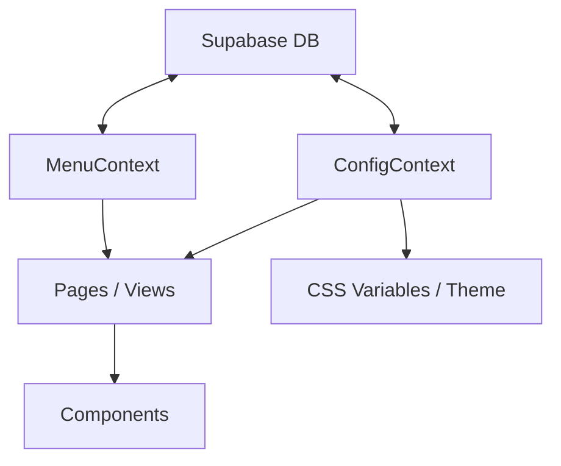

# Architecture Documentation - A Chabola

This document outlines the technical architecture, folder structure, and data flow of the **A Chabola** Digital Menu project.

## Technical Stack

- **Frontend**: React 19 + Vite
- **Styling**: Vanilla CSS + CSS Modules
- **State Management**: React Context API
- **Backend & Auth**: Supabase (Postgres, Auth, Storage)
- **Utilities**: jsPDF (PDF Generation), qrcode.react (QR Generation)

## Folder Structure

```text
/
├── public/                # Static assets (logos, PWA manifests, icons)
├── src/
│   ├── components/        # Reusable UI components (Layout, DishCard, etc.)
│   ├── context/           # React Context Providers for global state
│   │   ├── MenuContext    # Manages dishes and categories data
│   │   ├── ConfigContext  # Manages restaurant name, theme, and logo
│   │   └── ThemeContext   # Manages Light/Dark mode toggle
│   ├── data/              # Static data and definitions (Theme presets)
│   ├── pages/             # Main route views (Home, Admin, CategoryView)
│   ├── supabase/          # Supabase client configuration
│   ├── styles/            # Global styles and design tokens
│   └── App.jsx            # Main entry point and routing
├── db_setup.sql           # SQL scripts for database initialization
└── vite.config.js         # Build and development configuration
```

## Data Management & State

The application uses **React Context API** to manage global state without "prop drilling".

### Context Providers

1.  **MenuContext**: 
    - Fetches dishes and categories from Supabase.
    - Provides CRUD operations (Add, Edit, Delete, Toggle Visibility).
    - Handles image uploads to Supabase Storage.
    - Uses Realtime subscriptions to keep the menu updated across all clients.

2.  **ConfigContext**:
    - Manages the restaurant's identity (Name, Subtitle, Logo).
    - Injects dynamic CSS variables into the `:root` to apply themes selected from the admin panel.
    - Automatically updates the browser's tab title and favicon based on the configuration.

3.  **ThemeContext**:
    - Simple state for switching between Light and Dark modes.
    - Persists the user's preference in `localStorage`.

## Data Flow



## PWA Integration

The app is configured as a Progressive Web App (PWA):
- Uses `manifest.json` for installation metadata.
- Supports offline view (basic) and home screen installation.
- Responsive design optimized for both desktop and mobile devices.
